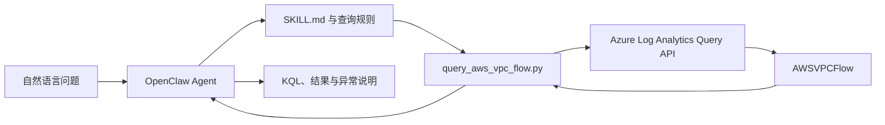

# Azure Log Analytics AWS VPC Flow Log Skill

这是一个面向 **OpenClaw** 的 Skill，用自然语言查询和分析 Microsoft
Sentinel / Azure Log Analytics 中的标准表 **`AWSVPCFlow`**。

用户不需要手写 KQL，可以直接提问：

- “过去一小时哪些来源 IP 被拒绝最多？”
- “有没有端口扫描或者 SSH/RDP 暴力破解？”
- “找出异常大流量外联。”
- “检查最近是否出现 `NODATA` 或 `SKIPDATA`。”
- “调查 `203.0.113.45` 最近做了什么。”
- “给我过去 24 小时流量最大的实例和目标地址。”

Skill 会把自然语言转换为受限的只读 KQL，调用 Azure Log Analytics Query
API，然后返回查询语句、结果和异常解释。

## 架构



## 功能

- 自然语言生成 `AWSVPCFlow` KQL。
- 查询拒绝流量、Top IP、端口、协议、VPC、Subnet、Instance 和 ENI。
- 识别端口扫描、SSH/RDP 暴力破解、横向移动和 ICMP 扫描。
- 识别异常大流量出口、异常管理端口外联和周期性 beaconing。
- 检查 `NODATA`、`SKIPDATA` 等采集健康问题。
- 支持 IPv4、IPv6、TCP、UDP 和 ICMP。
- 支持 JSON、Markdown 和 TSV 风格输出。
- 支持 Azure CLI、Managed Identity、Service Principal 和预获取 Token。
- 附带真实 Azure 部署脚本、标准表创建、DCR 和 Mock 数据写入工具。
- 查询接口只读，并阻止跨 Workspace、跨 Cluster、外部数据和多语句查询。

## 仓库结构

```text
.
├── README.md
├── SKILL.md
├── agents/openai.yaml
├── references/
│   ├── query-patterns.md
│   ├── schema.md
│   └── setup.md
├── samples/
│   ├── aws-vpc-flow-sample.json
│   ├── manifest.json
│   └── queries/
├── scripts/
│   ├── deploy_mock_azure.py
│   ├── generate_mock_data.py
│   ├── ingest_mock_data.py
│   └── query_aws_vpc_flow.py
└── tests/
```

## 安装到 OpenClaw

直接从 GitHub 安装：

```bash
openclaw skills install git:ottodeng/Azure-LA-AWS-VPC-FLOW-LOG@main
```

也可以克隆后本地安装：

```bash
git clone git@github.com:ottodeng/Azure-LA-AWS-VPC-FLOW-LOG.git
openclaw skills install ./Azure-LA-AWS-VPC-FLOW-LOG
```

安装完成后，新建 OpenClaw 会话，或者重启 Gateway：

```bash
openclaw gateway restart
```

## 运行要求

### 软件

- OpenClaw，支持 Git Skill 安装。
- Python 3.9 或更高版本。
- Azure CLI `az`，除非调用方直接提供短期访问 Token。

查询脚本仅使用 Python 标准库，不需要额外安装 Python 包。

### Azure

- 一个包含 `AWSVPCFlow` 表的 Log Analytics Workspace。
- Workspace Customer ID，而不是 ARM Resource ID。
- 执行查询的用户、Managed Identity 或 Service Principal。

### 最小权限

推荐给运行身份授予：

- Role：**Log Analytics Reader**
- Scope：单个 Log Analytics Workspace

不要为了查询方便直接授予订阅级 Owner 或 Contributor。

## 配置

```bash
export AZURE_SUBSCRIPTION_ID="<subscription-id>"
export AZURE_LOG_ANALYTICS_WORKSPACE_ID="<workspace-customer-id>"
```

Workspace Customer ID 可以这样读取：

```bash
az monitor log-analytics workspace show \
  --subscription "<subscription-id>" \
  --resource-group "<resource-group>" \
  --workspace-name "<workspace-name>" \
  --query customerId \
  -o tsv
```

## 认证方式

### 开发人员交互登录

```bash
az login
az account set --subscription "$AZURE_SUBSCRIPTION_ID"
```

### Azure VM Managed Identity

推荐生产环境使用，不需要保存 Client Secret：

```bash
az login --identity
```

如果是 User Assigned Managed Identity：

```bash
az login --identity --client-id "<managed-identity-client-id>"
```

### Service Principal

```bash
az login --service-principal \
  --username "<client-id>" \
  --password "<client-secret-or-certificate>" \
  --tenant "<tenant-id>"
```

不要把 Secret 提交到仓库或写进 OpenClaw 对话。

## 在 OpenClaw 中使用

安装后直接用自然语言提问即可。

### Sample 1：拒绝流量

```text
过去 6 小时拒绝次数最多的来源 IP 是哪些？列出拒绝次数、
访问过的端口数量和目标数量。
```

可能生成：

```kusto
AWSVPCFlow
| where TimeGenerated >= ago(6h)
| where Action =~ "REJECT"
| summarize Rejects=count(), DistinctPorts=dcount(DstPort),
    Targets=dcount(DstAddr) by SrcAddr
| top 20 by Rejects desc
```

### Sample 2：端口扫描

```text
检查最近一小时有没有来源 IP 在短时间内扫描大量端口。
```

```kusto
AWSVPCFlow
| where TimeGenerated >= ago(1h)
| where Action =~ "REJECT"
| summarize Attempts=count(), DistinctPorts=dcount(DstPort),
    DistinctTargets=dcount(DstAddr)
    by SrcAddr, bin(TimeGenerated, 5m)
| where DistinctPorts >= 20 or DistinctTargets >= 20
| order by Attempts desc
```

### Sample 3：异常外传

```text
找出过去 24 小时流向公网、累计超过 100 MB 的出口流量。
```

```kusto
AWSVPCFlow
| where TimeGenerated >= ago(24h)
| where FlowDirection =~ "egress" and Action =~ "ACCEPT"
| summarize Bytes=sum(Bytes), Packets=sum(Packets), Flows=count()
    by SrcAddr, DstAddr, DstPort
| where Bytes >= 100000000
| order by Bytes desc
```

### Sample 4：采集健康

```text
最近一天 AWS VPC Flow Logs 有没有 NODATA 或 SKIPDATA？
```

```kusto
AWSVPCFlow
| where TimeGenerated >= ago(24h)
| summarize Records=count() by LogStatus, bin(TimeGenerated, 1h)
| order by TimeGenerated desc
```

更多模式见 [`references/query-patterns.md`](references/query-patterns.md) 和
[`samples/queries`](samples/queries)。

## 直接运行查询脚本

```bash
python3 scripts/query_aws_vpc_flow.py \
  --query 'AWSVPCFlow | where TimeGenerated >= ago(1h) | take 10' \
  --timespan PT1H \
  --format markdown
```

输出格式：

- `--format json`
- `--format markdown`
- `--format table`

默认最多输出 200 行，可以通过 `--max-rows` 调整，上限为 5,000。

## 仓库自带 Mock 数据

仓库包含一份可直接查看或写入 Azure 的数据：

```text
samples/aws-vpc-flow-sample.json
```

它包含 **5,110 条**记录，固定随机种子和固定时间锚点，适合测试、演示和
回归验证。`samples/manifest.json` 提供记录数、场景分布、文件大小和
SHA-256，用于确认样例文件完整性。

| 场景 | 数量 |
| --- | ---: |
| 正常 Web 流量 | 2,240 |
| 端口扫描 | 560 |
| SSH 暴力破解 | 385 |
| RDP 暴力破解 | 315 |
| DNS 流量突增 | 490 |
| 大流量外传 | 84 |
| 横向移动 | 126 |
| ICMP 扫描 | 280 |
| 周期性 Beaconing | 336 |
| 异常管理端口外联 | 140 |
| `NODATA` / `SKIPDATA` | 84 |
| IPv6 | 70 |

所有公网地址均使用文档保留地址段，例如 `192.0.2.0/24`、
`198.51.100.0/24` 和 `203.0.113.0/24`。

样例是完全合成的数据，不包含本次开发测试使用的 Azure Subscription ID、
Tenant ID、Workspace ID、DCR ID、Principal ID、真实用户名、Token 或 Secret。

## 重新生成 Mock 数据

生成默认的 730 条记录：

```bash
python3 scripts/generate_mock_data.py
```

生成与仓库样例相同的 5,110 条记录：

```bash
python3 scripts/generate_mock_data.py \
  --scale 7 \
  --seed 20260811 \
  --now 2026-08-11T03:00:00Z \
  --output samples/aws-vpc-flow-sample.json \
  --manifest samples/manifest.json
```

## 创建 Azure Mock 环境

脚本会创建：

- 独立 Resource Group
- Log Analytics Workspace
- Microsoft Sentinel onboarding
- 官方 AWS VPC Flow Logs Solution
- 标准 `AWSVPCFlow` 表
- Direct DCR 和 Logs Ingestion Endpoint

```bash
python3 scripts/deploy_mock_azure.py \
  --subscription "<subscription-id>" \
  --resource-group "<mock-resource-group>"

source .azure-env

python3 scripts/ingest_mock_data.py \
  --input samples/aws-vpc-flow-sample.json
```

数据通常需要数分钟才能出现在查询结果中。

部署 Mock 环境需要创建资源和 Role Assignment 的权限；运行查询本身只需要
Workspace 级别的 Log Analytics Reader。

## 安全边界

- Log Analytics Query API 本身只读。
- 查询必须从 `AWSVPCFlow` 开始。
- 阻止跨 Workspace、跨 Cluster 和外部数据访问。
- 阻止 `join`、`union`、`search`、`evaluate` 和多语句查询。
- 不执行 Kusto Management Command。
- 不保存 Azure Token、Client Secret 或 Workspace Credential。
- `.azure-env` 和本地生成数据默认不会提交。
- 仓库内样例不包含任何真实 Azure 测试环境标识。

## 清理 Mock 环境

确认资源组只包含测试资源后执行：

```bash
az group delete \
  --subscription "$AZURE_SUBSCRIPTION_ID" \
  --name "<mock-resource-group>"
```

不要对客户生产 Workspace 执行该命令。

## 参考文档

- [AWSVPCFlow 表结构](https://learn.microsoft.com/azure/azure-monitor/reference/tables/awsvpcflow)
- [Azure Monitor Logs Ingestion API](https://learn.microsoft.com/azure/azure-monitor/logs/logs-ingestion-api-overview)
- [Azure Monitor Logs Query API](https://learn.microsoft.com/azure/azure-monitor/logs/api/overview)
- [OpenClaw Skills](https://github.com/openclaw/openclaw/blob/main/docs/tools/skills.md)
